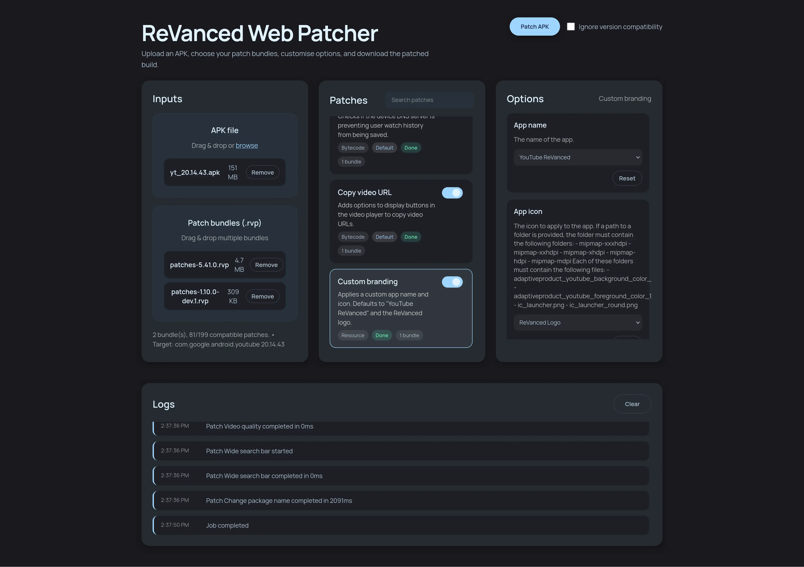

# ReVanced Web Patcher - Backend Service

A local API service for patching Android APKs with ReVanced patches. This backend processes everything on your machine - your APKs never leave your system.



## Overview

This is the **backend service** that powers the ReVanced web patcher. It provides a REST API for:
- Loading and analyzing patch bundles (`.rvp` files)
- Checking APK compatibility with patches
- Applying patches to APKs
- Signing patched APKs
- Real-time progress tracking via Server-Sent Events

## Official Frontend

The official web interface is hosted at **[https://revanced.aun.rest](https://revanced.aun.rest)** (closed source, ad-supported).

### How to Use

1. **Run this backend locally** (see instructions below)
2. **Visit [revanced.aun.rest](https://revanced.aun.rest)** in your browser
3. **Enter your backend URL** (default: `http://localhost:3000`)
4. **Patch your APKs** - all processing happens locally on your machine

The official frontend is supported by non-intrusive ads, which help fund continued development while preserving your privacy.

## Requirements

- **Windows, Linux, or macOS** (x64 or ARM64)
- **Java Runtime Environment 17+**
  - Check if installed: `java -version`
  - Download if needed:
    - Windows: [Bellsoft JRE 17 MSI](https://download.bell-sw.com/java/17.0.16+12/bellsoft-jre17.0.16+12-windows-amd64.msi)
    - Linux (DEB): [Bellsoft JRE 17 DEB](https://download.bell-sw.com/java/17.0.16+12/bellsoft-jre17.0.16+12-linux-amd64.deb)
    - Linux (RPM): [Bellsoft JRE 17 RPM](https://download.bell-sw.com/java/17.0.16+12/bellsoft-jre17.0.16+12-linux-amd64.rpm)
    - macOS: `brew install openjdk@17`

## Quick Start

1. **Download** the latest release from [Releases](https://github.com/Aunali321/revanced-web-patcher-backend/releases/latest)
2. **Extract** the ZIP archive
3. **Run** the backend:
   - **Windows:** Double-click `run-local.bat`
   - **Linux/macOS:** `chmod +x run-local.sh && ./run-local.sh`
4. **Verify** it's running: Open `http://localhost:3000/health`
5. **Use the frontend:** Visit [https://rv.aun.rest](https://rv.aun.rest)

The backend will run on port `3000` by default. You can change this by setting the `PORT` environment variable.

## Development

### Build from Source

```bash
./gradlew build
```

### Run Locally (Development)

```bash
./gradlew run
```

Or use the Gradle wrapper to build a distribution:

```bash
./gradlew installDist
```

Output will be in `build/install/web-patcher-service/`

### Environment Variables

- `PORT` - Server port (default: `3000`)
- `ALLOWED_ORIGINS` - Comma-separated allowed origins for CORS (default: allows all)
- `AAPT2_BINARY` - Path to custom `aapt2` binary (optional)

### Docker

```bash
docker build -t revanced-patcher-backend .
docker run -p 3000:3000 revanced-patcher-backend
```

## Project Structure

```
src/main/kotlin/
├── app/revanced/webpatcher/
│   ├── Application.kt              # Main server setup, CORS, routing
│   ├── routing/
│   │   └── PatchRoutes.kt         # API endpoints
│   ├── service/
│   │   ├── PatchService.kt        # Core patching logic
│   │   └── PatchMetadataService.kt # Patch analysis
│   ├── model/                     # Data models
│   ├── PatchJobRegistry.kt        # Job tracking & events
│   ├── Errors.kt                  # Error handling
│   ├── JsonMapper.kt              # JSON serialization
│   └── OptionParser.kt            # Patch option parsing
```

## License

This backend is licensed under **GNU Affero General Public License v3.0 (AGPL-3.0)**.

This means:
- ✅ You can use, modify, and distribute this software
- ✅ You must disclose source code of any modifications
- ✅ You must use the same AGPL-3.0 license for derivatives
- ❌ You cannot use this for commercial services without releasing your source code
- ❌ If you run a modified version as a web service, you must make the source available

See [LICENSE](./LICENSE) for full details.

**Important:** The official web frontend at [rv.aun.rest](https://rv.aun.rest) is **NOT** covered by this license. It is proprietary and closed source.

## Support

- 🐛 **Bug Reports:** [Open an issue](https://github.com/Aunali321/revanced-web-patcher-backend/issues)
- 💬 **Discussions:** [GitHub Discussions](https://github.com/Aunali321/revanced-web-patcher-backend/discussions)
- 📖 **Documentation:** See this README

## Disclaimer

This software is provided for educational purposes. The authors are not responsible for any misuse or damage caused by this program. Always respect application terms of service and applicable laws.
